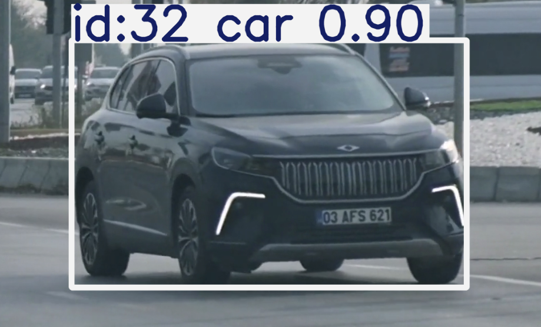
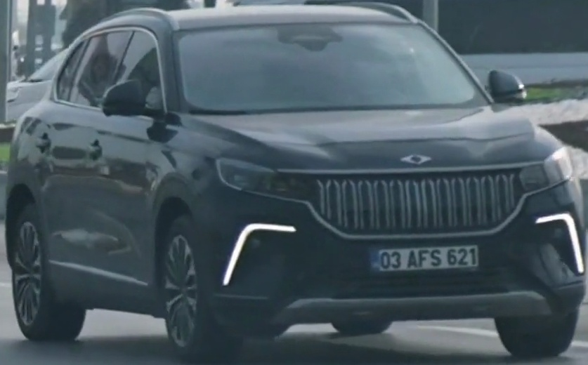
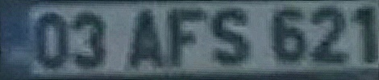
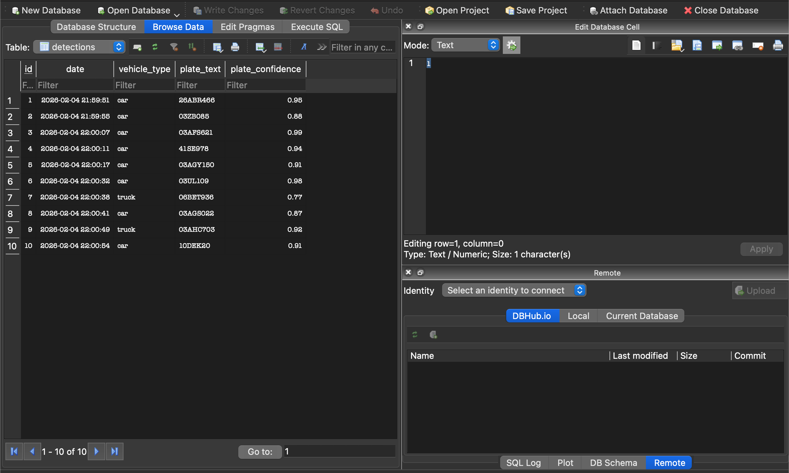
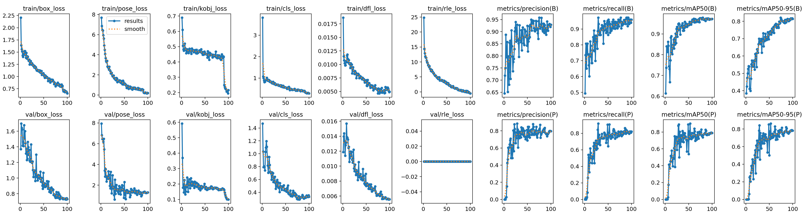

#  Traffic & License Plate Recognition System (ALPR)

This project is an  **Automatic License Plate Recognition (ALPR)** system designed to detect, track, and recognize license plates from traffic video footage.

It combines **YOLO26** for object detection and tracking, a custom **YOLO-Pose** model for precise license plate keypoint estimation, and **PaddleOCR** for high-accuracy text recognition. The system handles perspective distortion using homography and logs all data into an SQLite database.

##  Key Features

* **Real-time Tracking:** Uses **YOLO26 + ByteTrack** to detect and track vehicles (cars, trucks, buses, motorcycles) with persistent IDs.
* **Smart ROI Filtering:** Processes vehicles only when they cross a specific virtual line and meet size thresholds.
* **Pose Estimation:** Utilizes a custom Keypoint Detection model to identify the exact 4 corners of the license plate.
* **Perspective Correction:** Applies **Warp Perspective** (Homography) to flatten angled or skewed plates for better readability.
* **Heuristic Error Correction:** Automatically corrects common OCR errors (e.g., swapping '0'/'O', '1'/'I') based on standard Turkish license plate formats.
* **Asynchronous OCR:** Offloads heavy text recognition tasks to a background thread to maintain high video FPS.

##  System Pipeline (Step-by-Step Visualization)

The following pipeline demonstrates how a single vehicle is processed from detection to data logging.

### Step 1: Detection & Tracking
The system detects the vehicle in the video stream and assigns a unique Track ID.


### Step 2: Vehicle Cropping & ROI
Once the vehicle crosses the virtual line, it is cropped from the main frame.


### Step 3: Pose Estimation (Keypoints)
The Pose Model analyzes the crop to find the 4 corners of the license plate.


### Step 4: Perspective Warping & Processing
Using the keypoints, the plate is warped into a flat rectangle and sharpened.


### Step 5: OCR & Result
**PaddleOCR** reads the text, applies error correction, and logs the result.
> **Result:** `03AFS621` (Confidence: 0.99)

### Step 6: Data Logging
Final results are stored in a local SQLite database for historical analysis.


---
## 📈 Model Performance & Training

The custom **YOLO-Pose** model was trained to achieve high precision in license plate localization. Below are the training metrics, including loss curves (box, pose, classification) and mAP (mean Average Precision) scores.



---

## 📂 Project Structure

```text
📁 Traffic-ALPR/
│
├── main.py                           # Main application script
├── traffic_data.db                   # SQLite Database (Auto-generated)
├── yolo26n.pt                        # YOLO26 Object Detection Model
│
├── 📁 test_videos/
│   └── video-1.mp4                   # Input video
│
└── 📁 pose_results/keypoints_model/
    └── best-2.pt                     # Custom License Plate Pose Model
```

## ⚖️ License

This project is licensed under the **MIT License**.
